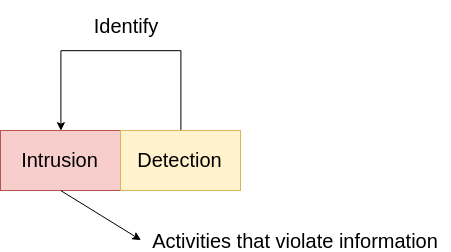
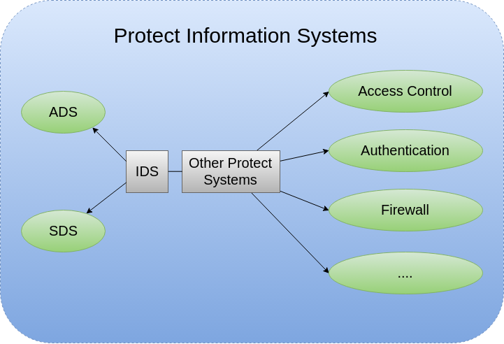
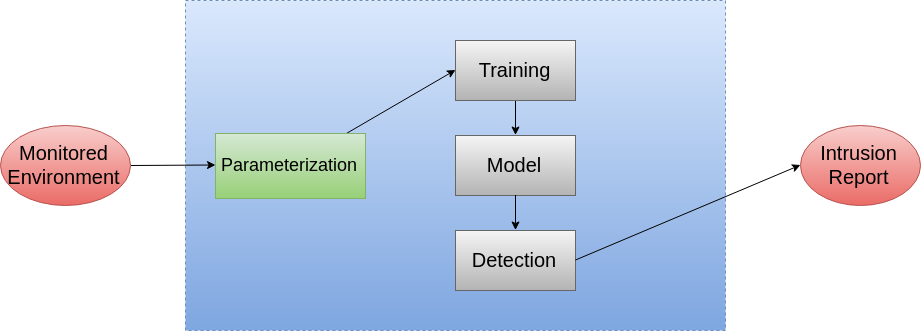

CÁC KĨ THUẬT MACHINE LEARNING CHO BÀI TOÁN ANOMALY DETECTION: OVERVIEW
===
Tổng thể
---
* Intrusion Detection nhận được sự quan tâm rộng rãi của các nhà nghiên cứu và doanh nghiệp.
* Intrusion Detection đang phải đối mặt với rất nhiểu khó khăn và hạn chế dù sau nhiều năm nghiên cứu.
* **Vấn đề** : Việc giảm thiểu một lượng lớn các false alert trong quấ trình detect vẫn chưa được giải quyết.
* Anomaly Detection được hứa hẹn trở thành chìa khóa giải quyết vấn đề Intrusion Detection, cụ thể là phát hiện lỗi, phát hiện thâm nhập, phát hiện tấn công, ... 
* Tài liệu này sẽ trình bày tổng quan về các kĩ thuật Supervised và Unsupervised cho quản lý vấn đề phát hiện lỗi.
* Các kĩ thuật được giới thiệu sẽ chỉ dừng lại ở việc áp dụng các lý thuyết như thế nào và sẽ chưa đi sâu vào việc tìm hiểu nguyên lý, các phần về nguyên lý sẽ được người viết bổ sung tại các bản báo cáo sau.
* Do người viết chưa có kinh nghiệm làm một giải pháp thực tế nào về AD và mới chỉ dừng lại ở việc hiểu biết cơ bản về Machine Learning, do vậy chắc chắn sẽ có nhiều sai sót, do vậy những ai đọc tài liệu này có thể góp ý để người viết khắc phục và bổ sung kiến thức, rất mong nhận được sử phản hồi của mọi người.

Các từ khóa quan trọng
---
*Supervised Machine Learning, Unsupervised Machine Learning, Network Intrusion Detection,*

Giới thiệu 
---
### Khái quát về Intrusion Detection
* Intrusion Detection có thể hiểu cơ bản qua sơ đồ sau: 
    

* Cơ sở của Intrusion Detection:
    * Coi như các hành vi xâm nhập sẽ khác biết đáng kể so với các hành vi hợp pháp, các xâm nhập sẽ làm khởi động và kích hoạt detection ghi nhớ các hoạt động không được chứng thực.
### Intrusion Detection System (IDS)
* IDS trong thực tế có thể thiết kế như là một module quan trọng trọng hệ thống bảo vệ thông tin chung của một cụm máy tính lớn.
* Sơ đồ mô phỏng IDS trong hệ thống bảo vệ thông tin chung:
    
### Sự quan trọng của IDS trong hệ thống bảo mật và phát hiện tấn công
* Nhiều hệ thống và ứng dụng bảo mật truyền thống được build và develop mà áp dụng một phương thức bảo mật nghiêm túc ngay cả cho chính chúng.
* Các hệ thống và ứng dụng bảo mật truyền thống dù có tốt đến đâu thì luôn tồn tại **lỗ hổng** và **bug**. Trong một vài tình huống các hệ thống này bị khai thác lỗ hổng, làm vô hiệu hóa và chiếm quyền điều khiển thì không những chúng trở nên vô dụng mà còn là công cụ cho phép kẻ xâm nhập gây thiệt hại lớn hơn. Nhìn chung, các hệ thống này không hiệu quả để xử lý các thâm nhập không thể nhận biết trước. 
* Bằng cách khắc phục nhược điểm trên, IDS giải quyết vấn đề xử lý các thâm nhập mới, các thâm nhập chưa được biết đến, giúp hoàn thiện tính bảo mật tổng thể của hệ thống.
* Tuy vậy IDS không thể thay thể toàn bộ cho cơ chế bảo mật, vì performance và tính trễ của IDS khó có thể đáp ứng được business requirements. IDS nên là một module phát hiện và cập nhật thông tin xâm nhập hơn là một hệ thống bảo mật tổng thể.
### Phân loại IDS
ADS: Anomaly Detection System
* Tông hợp các hoạt động trong hệ thống đê phát hiện xâm nhập theo một thuật toán nào đó.

SDS: Signal Detection System
* Phát hiện các hoạt động khả nghi theo tín hiệu thông báo đặc trưng như ```error``` hay ```warning```.

Ưu nhược điểm của 2 loại IDS


|Đặc điểm  | SDS       |    ADS     |
|----------|-----------|------------|
| Ưu điểm  | Phát hiện nhanh chóng các tấn công đã được nhận biết| Có khả năng phát hiện các tấn công chưa được biết. Tùy chỉnh các khả năng của các hoạt động bình thường.|
| Hạn chế| Không thể phát hiện được các tấn công chưa được biết. không có khả năng tùy chỉnh với các hoạt động bình thường | Hệ thống thường rất phức tạp. Lượng cảnh báo sai lớn. Khó khăn để phát hiện các kích thích cảnh báo.|

Các kĩ thuật Anomaly Detection
---
* Có rất nhiều kĩ thuật Anomaly Detection được xây dựng và phát triển trên nền Machine Learning, tuy vậy hầu hết chúng đều tuân theo một kiến trúc cơ sở như sau:
    
* Các kĩ thuật AD được áp dụng chia làm 2 nhóm lớn là *Supervised Anomaly D* và *Unsupervised AD*
### Supervised Anomaly Detection
- Yêu cầu một bộ dữ liệu nhãn chứa cả các mẫu thông thường và các mẫu độc hại để tiến hành xây dựng mẫu dự đoán.
- Về mặt lý thuyết, Supervised Anomaly Detection tốt hơn các phương pháp Semi-Supervised và Unsupervised
- Vấn đề gặp phải:
    - Training data thường rất ít so với lượng dữ liệu mà thực tế hệ thống phải xử lý.
    - Không chỉ các training data, phần lấy các nhãn sao cho đúng là một rào cản, chi phi lấy nhãn cho bộ dữ liệu không hề nhỏ, thậm chí còn rất khó trong việc gán nhãn nữa.
    - Các bộ training thông thường chứa nhiều nhiễu, dẫn đến tỉ lệ báo sai lỗi cao.
- Các giải thuật thông dụng:
    - Supervised Neural Network (SNN)
    - Support Vector Machine (SVM)
    - K - Nearest Neighbors (K-NN)
    - Bayesian Network (BN)
    - Decision Tree (DT)
### Unsupervised Anomaly Detection
- Không cần dữ liệu huấn luyện
- Thích hợp trong các bái toán có một lượng rất nhỏ dữ liệu là abnormal
- Các bất thường được coi như khác biệt đáng kể so với bình thường được coi là độc hại
- Vấn đề gặp phải:
    - Giảm chiều dữ liệu
    - Kiểm soát các trường hợp khác biệt lớn nhưng thực tế không độc hại
- Các giải thuật thông dụng;
    - K - means
    - Self - organization Map (SOM)
    - Expectation Maximization Meta (EM)
    - Adaptive Resonance Theory (ART)
    - Unsupervised Nich Clusting (UNC)
    - One Clas Support Vector Machine (OCSVM)
### Nhận xét
- Trong thực tế, để khắc phục nhược điểm của những giải thuật, các giải thuật sẽ được kết hợp để đem lại hiệu quả cao phù hợp với từng bài toán cụ thể.

So sánh các giải thuật Anomaly Detection
---
* Đa số các giải thuật Unsupervised được áp dụng để nâng cao hiệu năng trong tất cả các mức độ như clustering, features selecion hay classifications. 
* Bảng dưới đây sẽ tổng hợp ưu điểm và hạn chế của nhiều giải thuật

| Giải thuật        |  Ưu điểm             | Nhược điểm  |
|:-------------: |:-------------:| :-----|
|K-NN | <ul><li><div align='left'>Dễ hiểu khi có ít các biến dự báo</div></li><li><div align='left'>Hiệu quả cho việc xây dựng các mẫu không là kiểu dữ liệu chuẩn , như văn bản.</div></li></ul><left> |<ul><li><div align='left'>Yêu cầu một lượng lưu trữ lớn.</div></li><li><div align='left'>Thiếu một nguyên tắc để lựa chọn K, ngoại trừ việc kiểm tra chéo hoặc tương tự như vậy.</div></li> </li><li><div align='left'>Nhạy cảm với việc lựa chọn hàm.</div></li></li><li><div align='left'>Tốn kém tài nguyên tính toán.</div></li></ul>|
|Neural Network|<ul><li><div align='left'>Có thể xử lý các công việc mà kiểu lập trình tuyến tính không giải quyết được.</div></li><li><div align='left'>Khi có một phần tử bị lỗi, nó sẽ vẫn tiếp tục mà không có vẫn đề với parallel nature.</div></li><li><div align='left'>Một neural network có thể tự học và không cần lập trình lại.</div></li><li><div align='left'>Có thể áp dụng cho bất kì ứng dụng nào.</div></li></ul>|<ul><li><div align='left'>Neural network cần được train để hoạt động.</div></li><li><div align='left'>Kiến trúc của neural network khác với kiến trúc của vi xử lý nên cần phải lập trình mô phỏng.</div></li><li><div align='left'>Yêu cầu thời gian tính toán lâu đối với các neural network lớn.</div></li></ul>|
|Decision Tree|<ul><li><div align='left'>Đơn giản để hiểu và xử lý.</div></li><li><div align='left'>Yêu cầu ít dữ liệu chuẩn bị. </div></li><li><div align='left'>Có thể kiểm soát cả dữ liệu theo số và dữ liệu theo mục.</div></li><li><div align='left'>Sử dụng một mô hình whitebox.</div></li><li><div align='left'>Có thể validate mẫu băng việc sử dụng kiểm thử thống kê.</div></li><li><div align='left'>Xử lý mạnh.</div></li><li><div align='left'>Làm việc tốt với dữ liệu lớn trong một thời gian ngắn.</div></li></ul>|<ul><li><div align='left'>Vấn đề tìm lời giải tối ưu cho các bài toán dạng NP-complete.</div></li><li><div align='left'>DT Learner có thể tạo ra các cây quá phức tạp mà không thể trích xuất dữ liệu tốt được.</div></li><li><div align='left'>Có nhiều mô hình khó có thể học vì DT không phân tách chúng một cách dễ dàng.</div></li></ul>
|SVM|<ul><li><div align='left'>Tìm được các vùng phân biệt tố ưu.</div></li><li><div align='left'>Có thể làm việc tốt với dữ liệu nhiều chiều.</div></li><li><div align='left'>Một vài mô hình có vô hạn chiều vẫn có thể làm việc được</div></li><li><div align='left'>Thông thường hoạt động rất tốt.</div></li></ul>|<ul><li><div align='left'>Yêu cầu các ví dụ cả bình thường và bất thường.</div></li><li><div align='left'>Cần lựa chọn một kernel function tốt để đảm bảo hiệu năng.</div></li><li><div align='left'>Yêu cầu nhiều bộ nhớ và thời gian xử lý của CPU.</div></li></ul>
|SOM|<ul><li><div align='left'>Đơn giản và dễ hiểu giải thuật hoạt động.</div></li><li><div align='left'>Làm việc tốt ngay cả trên bộ dữ liệu phi tuyến tính.</div></li><li><div align='left'>Khả năng giảm chiều dữ liệu xuống còn dữ liệu 1 hoặc 2 chiều.</div></li></ul>|<ul><li><div align='left'>Giải thuật tốn thời gian tính toán.</div></li></ul>|
|K-means|<ul><li><div align='left'>Độ phức tạp thấp.</div></li></ul>|<ul><li><div align='left'>Cần xác định k</div></li><li><div align='left'>Nhạy cảm với nhiễu   và các điểm dữ liệu ngoại biên.</div></li><li><div align='left'>Các cluster nhạy cảm với việc khởi tạo các điểm trung tâm.</div></li></ul>|
|Fuzzy C-means|<ul><li><div align='left'>Cho phép các điểm dữ liệu có thể thuộc nhiều cụm.</div></li><li><div align='left'>Kiểu đại diện tự nhiên hơn so với các giải thuật sử dụng logic kinh điển. </div></li></ul>|<ul><li><div align='left'>Cần phải xác định c, số các cluster. </div></li><li><div align='left'>Các cluster nhạy cảm với việc khởi tạo các điểm trung tâm.</div></li></ul>|
|Expectation-Maximization Meta|<ul><li><div align='left'>Dễ dàng thay đổi mẫu để thích nghi với các phân bố data khác nhau.</div></li><li><div align='left'>Số các tham số không tăng khi training data tăng.</div></li></ul>|<ul><li><div align='left'>Bao phủ chậm trong một vài trường hợp.</div></li></ul>|
|||

Tổng kết
---
Các kĩ thuật Machine Learning được ứng dụng trong thực tế khắc phục nhược điểm thiếu tri thức trong kĩ thuật phát hiện cơ bản. Nhiều giải thuật đã được ứng dụng trong thực tế và đem lại kết quả tốt. Bài viết này chỉ nhằm để đánh giá tổng quan về vấn đề áp dụng Machine Learning trong bài toán Anomaly Detection và một và ưu nhược điểm của một số ít các thuật toán. Với các phương thức supervised, hiệu năng tốt nhất đạt được bằng các phương thức phi tuyến như SVM, MLP và các phương thức rule-based . SOM, OCSVM , K-means, FC-ANN là các thuật toán tốt trong unsupervised mặc dù chúng khác nhau về khả năng có thể phát hiện tấn công một cách hiệu quả.

Tài liệu thảm khảo
---
* Machine Learning Techniques for Anomaly Detection:
An Overview - Salima Omar, Asri Ngadi, Hamid H. Jebur - International Journal of Computer Applications (0975 – 8887)
Volume 79 – No.2, October 2013
