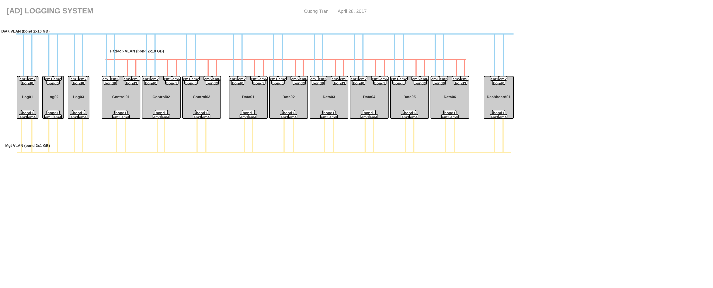
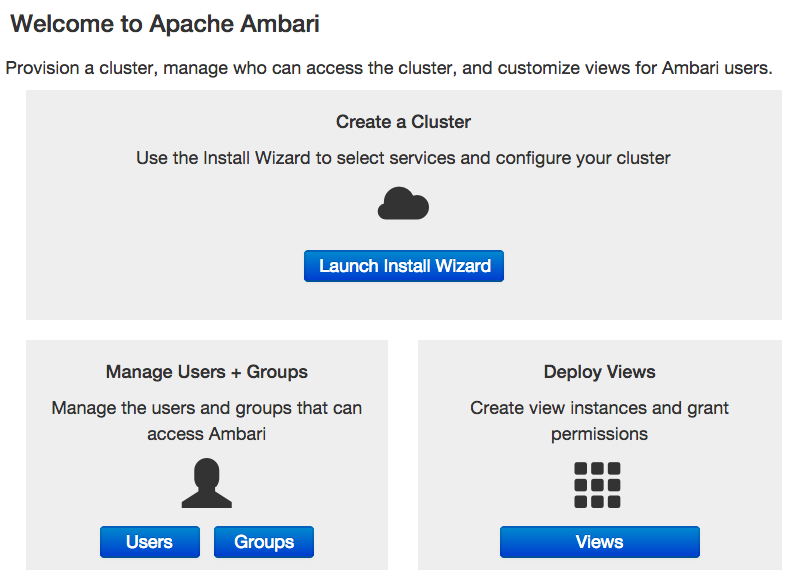
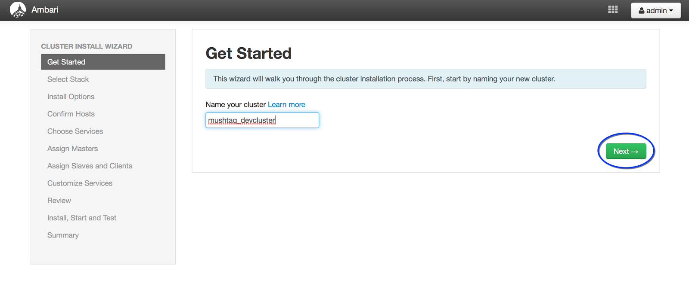
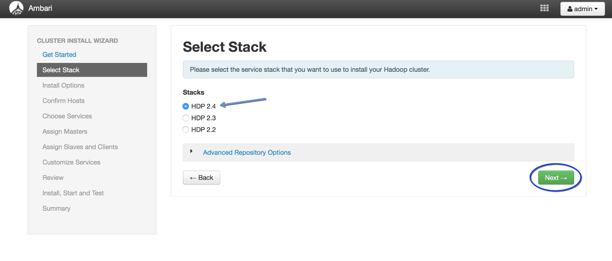
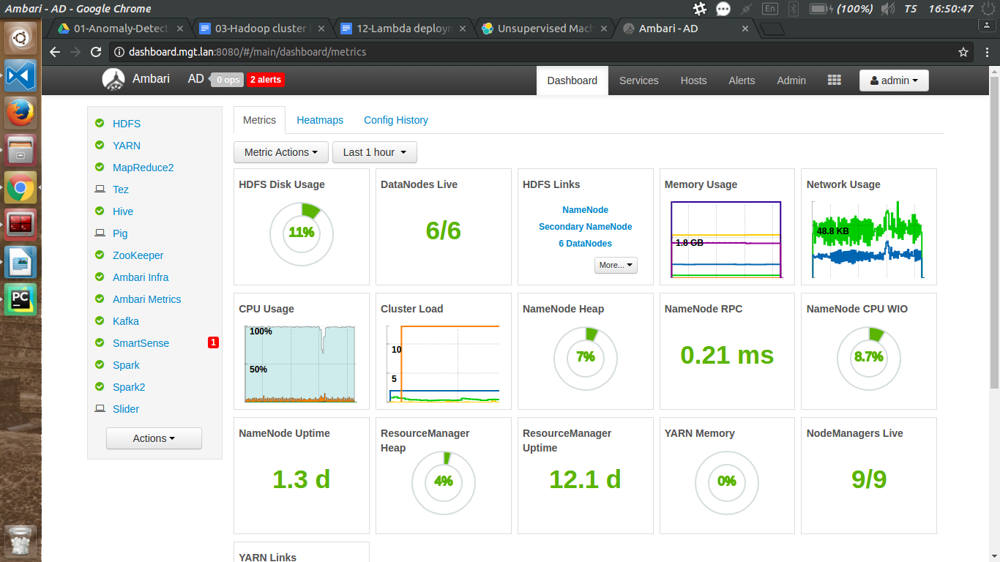

CÀI ĐẶT HỆ THỐNG LAMBDA
===

Mô tả kiến trúc Lambda
---
### Tổng thể
Kiến trúc Lambda là một cụm gồm 14 host được phân theo các chức năng khác nhau. Có 4 nhóm host theo các chức năng như sau:
* **Dashboard**: Thực hiện các thao tác liên quan đến giao diện trực quan tới superuser.
* **Log**: Thực hiện nhiệm vụ liên quan đến các thao tác logging.
* **Controller**: Thực hiện các thao tác liên quan đến quản lý và điều phối tài nguyên tính toán giữa các host như các datanode, app timeline server, metric collector, ...
* **Data**: Chịu trách nhiệm lưu trữ dữ liệu phục vụ tính toán và các thao tác vào ra tương ứng theo sự điều phối của các Controller.
### Kiến trúc Lambda và các thành phần của kiến trúc Lambda
#### Kiến trúc Lambda
Kiến trúc lambda được mô phỏng cơ bản như sau:

#### Các thành phần của kiến trúc Lambda
* Các cấu hình của từng host này được trình bày khái quát trong bảng sau:
[Lambda deployment Demo](https://docs.google.com/spreadsheets/d/1iscbqkAMLdEXRGHbYO2HZ_cgEGEyA45_rBtMSeiCR-M/edit?usp=sharing)
* Hiện tại đang trong quá trình develop nên các ip của dải hadoop sẽ lấy theo hostname của dải mgt.
### Cấu hình các phiên bản triển khai
#### Các phiên bản yêu cầu cho hệ thống chính
* Ambari: 2.5.1.0
* HDP: 2.6.1
#### Thu thâp thông tin trên các host
Sử dụng cấu lệnh ```hostname -f``` để kiểm tra FQDN của một host. Sử lại sao cho đúng với cấu hình được ghi trong **Lambda Deployment Demo**

Chuẩn bị môi trường 
---
### Thiết lập password-less SSH connection
Để Ambari Server có thể tự động cài đặt Ambari Agents tới tất cả các hosts phải thiết lập các kết nối **Pasword-less SSH** giữa Ambari Server cho tất cả các host trong cụm. Ambari Server sử dụng xác thực SSH public keys để điều khiển truy cập và cài đặt Ambari Agent.
* Bước đầu tiên, tạo public SSH keys và private SSH Keys trên Ambari Server:
```
ssh-keygen 
```
* copy SSH public key tới các host được chỉ định
```
~/.ssh/id_rsa.pub
```
* Thêm SSH public key này vào file *authorized_keys* cung thư mụ:
```
cat id_rsa.pub >> authorized_keys
```
* Đặt permission trên thực mục ~/.ssh và file authorized_keys trong các host chỉ định:
```
chmod 700 ~/.ssh
chmod 600 ~/.ssh/authourzied_keys
```
* Thử các kết nối SSH và xác nhận các host cho những lần truy cập sau:
```
ssh root@<remote.target.host>
```
* Lưu trữ bản sao của SSH Private Key của host Dashboard cho bước sau
### Khởi động NTP trên cụm và trên host Dashboard
NTP cần phải được cài đặt trên tất cả các host của cluster nhằm đảm bảo Ambari Server interface được đồng bộ với nhau:
* Để cài đặt NTP Service, chạy dòng lệnh sau trên tất cả các host:
```
yum install -y ntp
```
* Kiểm tra NTP Service có được chạy tự động khi khởi động, chạy lệnh sau cho từng host:
```
chkconfig --list ntpd
```
* ĐẶt NTP Service tự động khởi động, chạy lệnh sau:
```
chkconfig ntpd on
```
* Khởi động NTP Service cho từng host:
```
service ntpd start
```
### Kiểm tra DNS và FQDN
Việc kiểm tra DNS và FQDN của các host nhằm đảm bỏa cho việc giao tiếp giữa các host với nhau và các host với các mạng khác (e.g. Internet ) được thông suốt. Qua đó tránh được các trường hợp không thể trao đổi các thông tin cần thiết trong quá trình tiến hành cài đặt và thử nghiệm hệ thống.
#### Kiểm tra DNS
* Thực hiện việc kiểm tra trên tất cả các host theo câu lệnh sau:
```
vi /etc/hosts
```
* Thêm các dòng thỏa mãn sau vào file host. Đó là danh sách các host được config trong cụm kèm theo ip tương ứng theo mấu sau:
```
1.2.3.4 <F.Q.D.N>
```
* Ví dụ với control01.mgt.lan:
```
10.10.10.104 control01.mgt.lan
```
* Tiếp tục chỉnh sửa network configuration file sau:
```
vi /etc/sysconfig/network
```
* Thay đổi hostname theo đúng FQDN tương ứng của các hosts:
``` 
NETWORKING=yes
HOSTNAME=<F.Q.D.N>
```
* Ví dụ với control01.mgt.lan:
```
NETWORKING=yes
HOSTNAME=control01.mgt.lan
```
* Kiểm tra lại với câu lệnh sau:
```
hostname -f
```
### Config iptables, disable SELinux, PackageKit và check umask Value
#### Config iptables
Để Ambari Server có thể giao tiếp trong quá trình thử nghiệm và quản lý hệ thống, một vài trạng thái phải được đảm bảo được cho phép và luôn sẵn sàng.
* Cách thức dễ dàng nhất để thực hiện là vô hiệu hóa iptables vĩnh viễn, như dưới đây:
``` 
chkconfig iptables off
/etc/init.d/iptables stop
```
* Để chắc chắn có thể khởi động lại iptables:
```
/etc/initd.iptables restart
```
### Disable SELinux 
SELinux là một tính năng bảo mật mạnh, tuy nhiên nó lại là rào cản lớn trong việc giao tiếp nhiều máy tính với nhau ở mức độ cao. Cụ thể sẽ gây từ chối quyền truy ập các thư mục thông qua permission của chúng. Do đo phải vô hiệu hóa SELinux cho việc cài đặt Ambari Server:
* Từng host trong cụm chạy lệnh sau:
```
setenforce 0 
```
* Có thể vô hiệu hóa vĩnh viễn bằng cách thiết lập SELinux=disabled trong file:
```
/etc/selinux/config
```
### Disable PackageKit
Nếu các host đã cài đặt PackageKit, chỉnh sửa file ```/etc/pluginconf.d/refresh-packagekit.conf``` và thay đổi như sau:
```
enabled=0
```
### Check umask Value
* Đặt umask cho phiên login hiện tại
```
umask 0022
```
* Kiểm tra umask hiện tại:
``` 
umask 0022
```
* Thay đổi viễn viễn umask cho tất cả các user:
```
echo emask 0022 >> /etc/profile
```
Sử dụng Local Repositories
---
### Thiết lập Local Repositories 
Việc thiết lập Local Repositories để đảm bảo việc cài đặt không bị ảnh hưởng bởi Internet.
* Thiết lập server chứa các repository cần thiết trong một host. VD: Trong cụm này được đặt trên host **dashboard.mgt.lan**
* Download các repo đặt trên host chưa local repository.
### Chuẩn bị các file config repositories
Trong hệ thống này, chúng ta sẽ sử dụng 3 repo là **ambari.repo**, **HDP.repo** và **HDP-utils.repo**. Tuy vậy chỉ cần tạo thủ công 1 file là ambari.repo. Các file repo khác sẽ được tự động thêm vào tại phần tuỳ chỉnh cài đặt ở bước sau đối với các host còn lại trong cụm.
* Các repo sẽ cấu hình với các Base URL như sau:
    * Ambari Base URL: [http://dashboard.mgt.lan/ambari/centos6/ambari-2.5.1.0/](http://dashboard.mgt.lan/ambari/centos6/ambari-2.5.1.0/)
* Thực hiện paste các Base URL bằng các tạo repo tương ứng trong thư mục ```/etc/yum.repos.d/```.
* Với mỗi repo tạo theo mẫu định dạng 1 repo, lưu ý là ```gpgcheck``` nên ```set=0``` cho tiên xử lý ( vì không dùng đến Internet thì cũng chẳng phải check lại làm gì). 
* Custom baseurl theo các URL trên.

Cài đặt Ambari Server
---
### Download Ambari Repo
* Kiểm tra các repo trên server Dashboard:
``` 
yum repolist
```
* Chạy lệnh dưới đây trên server Dashboard:
``` 
yum install ambari-server
```
* Nhấn ```y``` để xác nhận kiểm tra.
### Thiết lập Ambari Server
* Chạy lệnh dưới đây để sẵn sàng thiết lập:
``` 
ambari-server setup
```
* ```Customize user account for ambari-server daemon``` chọn ```n``` ( để mặc định là acccount root)
* Phần check Oracle JDK nên chọn 1 (mới nhất)
* ```Enter advanced database configuration``` > chọn ```n```
### Khởi động Ambari Server
* Chạy cluster trên theo lệnh:
```
ambari-server start
```
Cài đặt, cấu hình và triển khai cluster
---
### Truy cập Ambari Server
* Kiểm tra để xác nhận rằng Ambari Server phải được hoạt động:
```
ambari-server status
```
* Truy cập Ambari Server bằng baasts kì trình duyệt nào qua địa chỉ:
[http://dashboard.mgt.lan:8080](http://dashboard.mgt.lan:8080)
* Truy cập Ambari Server sử dụng **username/password** mặc định là **admin/admin** (mặc định ) .
### Chạy Ambari Server Installation Wizard
* Từ trang Ambari Welcome, chọn **Launch Install Wizard**:

* Đặt tên cluster
    * Tên cho cluster là AD
    * Hình minh họa: 
* Lựa chọn phiên bản
    * Lựa chọn HDP 2.6 và phiên bản cụ thể là 2.6.1.0.
    * Hình minh họa 
* Tích vào lựa chọn **Local Repository**. Remove hết các phiên bản OS ngoại trừ **Redhat6**.
* Copy **BaseURL** trong Local vào **BaseURL** dòng dưới theo các tên tương ứng.
### Cài đặt các option
* Trong **Target Hosts**, liệt kê các danh sách trong cluster từng dòng một:
    * dashboard.mgt.lan
    * log01.mgt.lan
    * log02.mgt.lan
    * log03.mgt.lan
    * control01.mgt.lan
    * control02.mgt.lan
    * control03.mgt.lan
    * data01.mgt.lan
    * data02.mgt.lan
    * data03.mgt.lan
    * data04.mgt.lan
    * data05.mgt.lan
    * data06.mgt.lan
* Copy **Private SSH Key** của **Dashboard** và paste vào mục yêu cầu **SSH Key**, có thể lấy **SSH Key** này qua lệnh:
```
cat ~/.ssh/id_rsa
```
### Xác nhận các host
Xử lý các vấn đề phát sinh và test lại qua hộp thoại retry và Rerun Checks
* Tiến hành disable THP trên tất cả các host theo câu lệnh sau:
```
echo never > /sys/kernel/mm/transparent_hugepage/enabled
echo never > /sys/kernel/mm/transparent_hugepage/defrag

```
### Lựa chọn các service
Các Service được chọn là: 
**HDFS, YARN, MapReduce2, Tez, Hive, Pig, ZooKeeper, Ambari Infra, Ambari Metrics, Kafka, SmartSense, Spark, Spark2, Slider**
### Phân công các master
Thực hiện theo chi tiết của tệp tin chi tiết thành phần.
* Các **master** ở đây sẽ lấy là các host: **controller**, **log** và **dashboard**
* Các **data** sẽ là **slave**.
### Phân công các slave và client
* Tích **datanode** và tất cả các host **data**.
* Tất cả các host đều phải tích **NodeManager** .
* Tích **client** vào host **Dashboard**.
### Tùy chỉnh Service
* Khắc phục toàn bộ các lỗi và warning để đảm bảo cho việc cài đặt được hoàn thiện.
* VD: Set Tez Memory là 512MB
### Review
* Chi tiết Review được lưu trong  đường dẫn sau: AD Cluster Info
### Cài đặt, khởi động và thử nghiệm
* Tiến hành các thao tác tiếp theo 
### Hoàn thành


Config đưa log vào Kafka qua Filebeat
----
* Config để kafka listen all port.
    - Config như trên: `PLAINTEXT://:6667`với các Kafka Broker
    - Với config kiểu trên, thông tin broker sẽ lấy địa chỉ là hostname của máy.
* Cách kafka, (or filebeat) hoạt động: Tụi nó lấy thông tin IP của broker giống như thông tin đã lưu trong Zookeeper.
* Với bên host dùng để bắn log qua filebeat. Chỉnh sửa config theo dạng sau:
```
output.kafka:
  # initial brokers for reading cluster metadata
  hosts: ["ip:6667"]

  # message topic selection + partitioning
  topic: 'test1st-hostvn'
  partition.round_robin:
    reachable_only: false

  required_acks: 1
  compression: gzip
  max_message_bytes: 1000000
```
* Yêu cầu các topic phải được tạo trước khi bắn log để đảm bảo việc bắn log
* Kiểm tra băng cách thực hiện các thao tác của Kafka
Tài liệu tham khảo
---
[Docs HDP](https://docs.hortonworks.com/HDPDocuments/HDP2/HDP-2.6.1/index.html)

[HDP Greatting Ready](
https://docs.hortonworks.com/HDPDocuments/Ambari-2.5.1.0/bk_ambari-installation/content/ch_Getting_Ready.html)

[HDP Config](
https://docs.hortonworks.com/HDPDocuments/Ambari-2.5.1.0/bk_ambari-installation/content/ch_Deploy_and_Configure_a_HDP_Cluster.html
)
