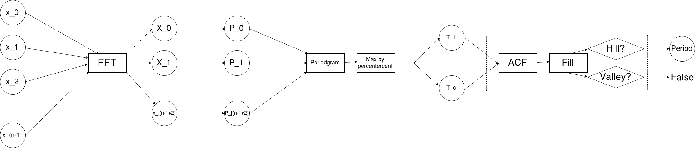
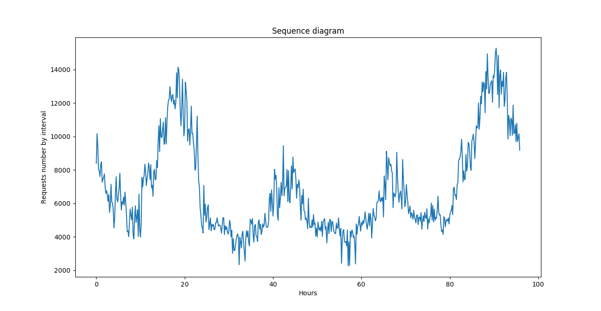
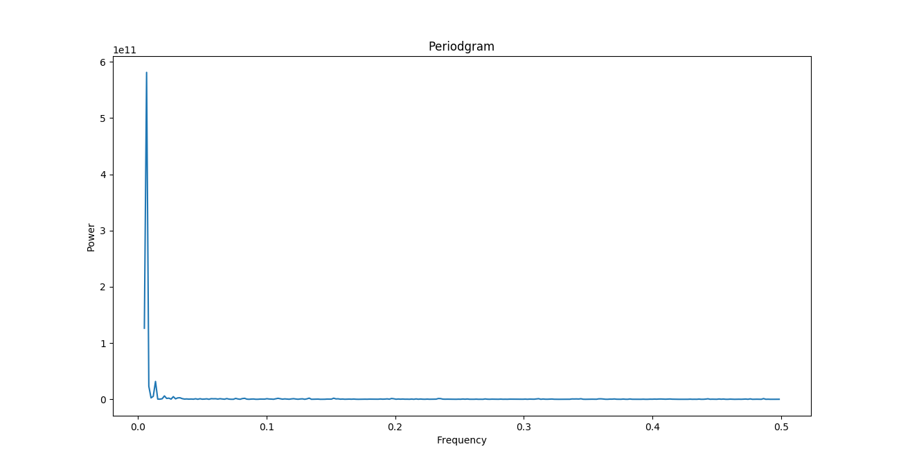
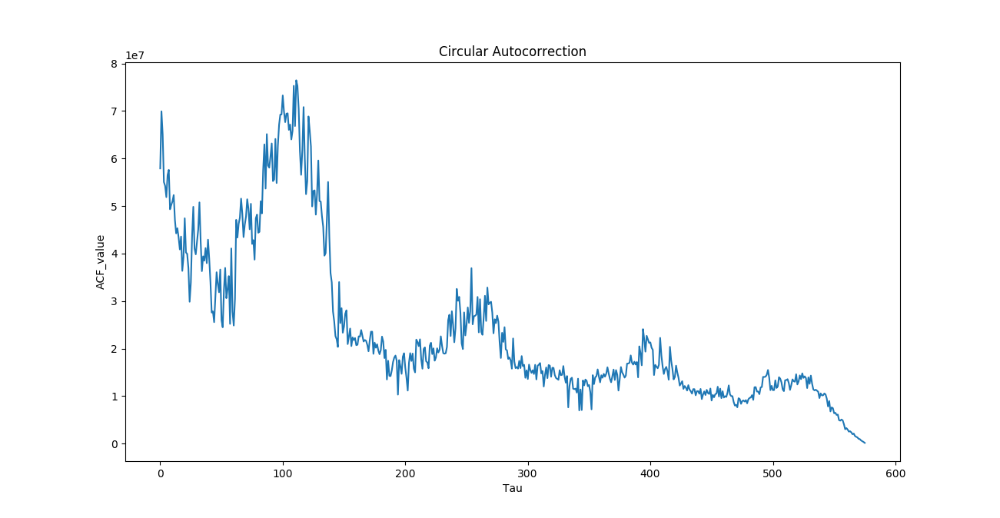

Phát hiện chu kì một chuỗi thời gian theo giải thuật AUTOPERIOD
===

# Tổng quan
* Trong công việc phân tích và khai phá dữ liệu, có rất nhiều trường hợp các nhà phân tích gặp phải dạng dữ liệu là một chuỗi thời gian theo một hoặc một vài thuộc tính nào đó. Các chuỗi thời gian này có rất nhiều tính chất quan trọng như tính chu kì, tính phụ thuộc lẫn nhau giữa các phần tử, tính phụ thuộc của phần tử vào một thông tin ngoài hệ thống nào đó (như mùa, thời điểm, năm, ...).
* Việc tìm hiểu các chuỗi thời gian đóng vai trò quan trong việc phân tích dữ liệu. qua các phân tích dữ liệu này, ta có thể tìm hiểu về tính chất của chuỗi và phục vụ vào các thao tác như: dự đoán, phát hiện bất thường, tìm chu kì của chuỗi, ...
* Với giải thuật AUTOPERIOD, chuỗi thời gian bất kì (thường là một dữ liệu trên trung bình) có thể tìm được chu kì của chúng hoặc kết luận không tìm được chu kì, phần chi tiết giải thuật sẽ được trình bày vào phần tiếp theo.

# Chi tiết giải thuật
## Tổng quan giải thuật 

## Nền tảng tính toán 
### Biến đổi Fourier rời rạc (DFT) và dạng biến đổi Fourier nhanh (DFT)
* Sử dụng biến đổi Fourier rời rạc để xử lý chuỗi thời gian gốc thành chuỗi các biên độ tương ứng.
### Phổ mật độ công suất và biểu đồ chu kì (Periodgram)
* Phổ mật độ công suất thể hiện tích lũy năng lượng trong các thành phần tương ứng trong chuỗi Fourier, năng lượng càng lớn thì thông tin càng có giá trị
* Biểu đồ chu kì là biểu diễn các giá trị năng lượng đó tương ứng với tần số tín hiệu tương ứng (f=k/N)
* Vì các năng lượng lớn nhất **có khẳ năng** sẽ chứa thông tin về chu kì của chuỗi thời gian, do vậy ta sẽ lấy một lượng đủ nhỏ để đại diện cho các chu kì tiềm năng:
* Làm tròn các chu kì sau đó để phục vụ việc trích xuất các mẫu chu kì.
### Hàm tự tương quan
* Các chu kì tiềm năng chưa chắc đã là các chu kì đủ tốt cho các chuỗi thời gian này, do vậy cần xử lý bằng cách xét qua các hàm tự tương quan tương ứng của các phần tử trong chuỗi thời gian.
* Qua thực nghiệm chứng minh, giá trị hàm tự tương quan (ACF) cần xét có xu hướng tăng ( trên đồi ) sẽ rất tốt, còn lại các giá trị hàm tự tương quan có xu hướng giảm tại lân cận ( dưới thung lũng) không thực sự khả quan.
### Lọc chu kì không có giá trị
* Các chu kì không có giá trị là các chu kì mà giá trị của nó xấp xỉ bằng hoặc bằng một nửa (trong nhiều trường hợp) số phần tử của chuỗi giá trị đó.
* Các chu kì này thực sự không phải là chu kì mà chúng ta cần tìm. Trong phần lớn các trường hợp, các chu kì trên đại diện cho chuỗi thời gian không có chu kì.

# Tiếp cận dữ liệu
## Thông tin dữ liệu
* Dữ liệu được thử nghiệm được lấy từ bộ dữ liệu World Cup 98 trong 4 ngày 6, 7, 8, 9
* Biến đổi dữ liệu về dạng thuận lợi cho việc tính toán băng các đếm số request trong 1 khoảng thời gian cho trước, do vậy chúng ta có thể có một chuỗi thời gian mới với các giá trị đại số cụ thể ( chuỗi thời gian số request trong 1 vài ngày).
## Thử nghiệm dữ liệu
* Biểu đồ chuỗi thời gian ban đầu:

* Biểu đồ phân bố năng lượng:

* Biểu đồ phân bố giá trị hàm tự tương quan:

# Các vấn đề 
* Trong chuỗi thời gian trong một ngày, giá trị của phần tử đầu tiên luôn ở trạng thái trội
* Do chưa thử nghiệm với nhiều dữ liệu và dữ liệu lớn nên chưa thể đánh giá thực nghiệm trực quan một các tương đối chính xác.
* Tuy vậy, giải thuật đưa ra các chu kì rất khả quan với tập dữ liệu vừa xử lý.
# Tài liệu tham khảo

* Giải thuật AUTOPERIOD: On Periodicity Detection and Structal Periodic Similarity - Michail Vlachos, Philip Yu, Vittorioi Castelli.
* Các tài liệu đối chiếu: PD-GABP - A Novel Prediction Model Applying for Elastic Applications in Distributed Environment - Dang Tran, Nhuan Tran, Binh Minh Nguyen, Hieu Le
* Tài liệu tham khảo thêm: PRESS: PRedictive Elastic ReSource Scaling
for cloud systems - Zhenhuan Gong, Xiaohui Gu, John Wilkes
