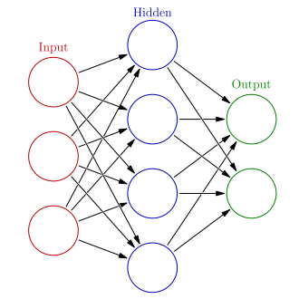
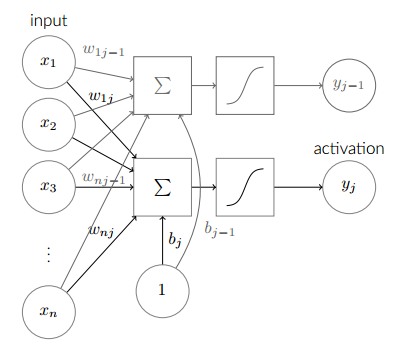

# Tổng quan về Deep Learning

## Định nghĩa
Không có một định nghĩa duy nhất cho Deep Learning. Tuy nhiên các định nghĩa đều có những điểm chung:
- Deep Learning là một nhánh của Machine Learning
- Mô hình là một đồ thị (network) với nhiều lớp tính toán, từ "deep" để chỉ độ sâu của lớp
- Sử dụng các lớp với đơn vị xử lý phi tuyến
- Sử dụng cả phương pháp học có giám sát và học không giám sát

## Ứng dụng
- Xử lý ngôn ngữ tự nhiên
- Xử lý ảnh, nhận dạng vật thể
- Xử lý tiếng nói
- Xử lý văn bản, dịch máy

## Kiến trúc tổng quát của mạng neural nhân tạo (Artificial Neural Network- ANN)

Processing Elements (PE): Các đơn vị xử lý trong một ANN được gọi là các neuron, mỗi neuron nhận các dữ liệu vào (input) xử lý chúng và cho ra một kết quả (output) duy nhất. Kết quả xử lý của một neuron có thể làm input cho các neuron khác.

Kiến trúc chung của một ANN gồm 3 thành phần:
- Input Layer
- Hinđen Layer
- Output Layer

Trong một ANN có thể có nhiều Hidden Layer.

## Mạng neural sâu (Deep Neural Network - DNN)
Mạng neural sâu (DNN-Deep Neural Network) là một mạng neural nhân tạo (ANN) với nhiều đơn vị lớp ẩn giữa lớp đầu vào và đầu ra. Tương tự như các ANN nông, các DNN nông có thể mô hình mối quan hệ phi tuyến phức tạp.

**Ví dụ một mạng DNN đơn giản**

- Một neuron là một biến đổi phi tuyến của tổng tuyến tính các input: 
`y = f(w'x + b)`, trong đó `w'` là ma trận chuyển vị của `w`.
- Một dãy các neuron nhận cùng một input từ input layer: `y = f(W'x + b)`
- Layer tiếp theo: `y2 = f(W2' * f(W1'x + b1) + b2)`

Các vấn đề đối với DNN: overfitting và thời gian tính

## Một số kiến trúc DNN
- Convolutional neural networks
- Convolutional deep belief networks
- Deep belief network
- Deep Q-networks
- Deep coding networks

## Một số Framework 
- TensorFlow
- Theano
- Torch
- Caffe
- CNTK

## Tham khảo
- https://en.wikipedia.org/wiki/Deep_learning
- http://machinelearningmastery.com/what-is-deep-learning/
- http://bis.net.vn/forums/t/482.aspx
