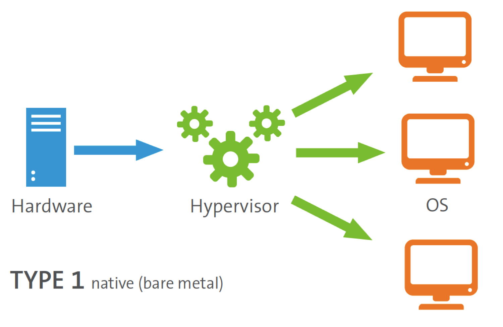
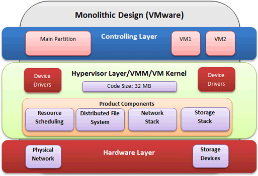
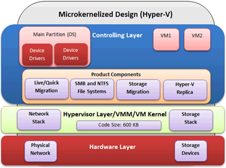
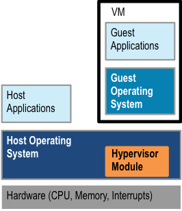
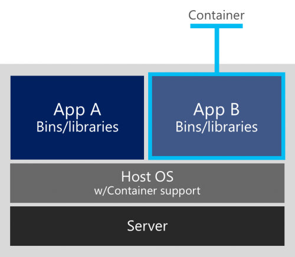
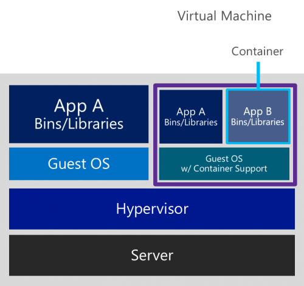

# TÌM HIỂU VỀ HYPERVISOR VÀ CONTAINER

Trong thời gian hiện nay các công nghệ ảo hóa và các vấn đề liên quan thu hút được sự quan tâm của rất nhiều các nhà khoa học, nhà phát triển, lập trình viên và các doanh nghiệp. Những ưu điểm về công nghệ về ảo hóa thúc đẩy việc phát triển các phần mềm thiết kế ảo hóa, được gọi chung là Hypervisor.

##  1. Hypervisor là gì?

Hypervisor là một ứng dụng phụ trách việc chạy các máy ảo trên cùng một hệ thống. Nó chịu các trách nhiện như: Tạo , duy trì, truy cập hệ thống. 

##  2. Các loại Hypervisor
###    a.  Hypervisor type-1 (bare-metal Hypervisor)
- Hypervisor chạy trên phần cứng của Server, có nhiều quyền điều khiển phần cứng, do đó cung cấp hiệu suất và khả năng bảo mật tốt hơn.
    VD: VMWare vSphere, Microsoft Hyper-V, Citrix XenServer, ....

- Cơ chế máy ảo liên lạc với tài nguyên phần cứng:
    + Hypervisor mô phỏng phần cứng.
    + Hypervisor liên lạc với device drivers.
    + Device drivers liên lạc với các thiết bị phần cứng.

- Phân loại Hypervisor Type-1:
    + Monolithic Hypervisor:
        + Đặc điểm: Các Lớp Hypervisor nắm giữa device drives cho Guest-OS
        + Ví dụ: Microsoft Hyper-V
        + Kiến trúc:

        

        + Ưu điểm:
            + Không cần hệ điều hành để điều khiển tất cả các thành phần của virtualization product, có thể truy cập trực tiếp đến phần cứng, mang lại hiệu suất cao.
        + Khuyết điểm: 
            + Không thể hoạt động được trên các Unsupported Hardware
                VD: vSphere, VMWare ESXi
            + Code-size lớn => Thời gian khỏi động dài
            + Bảo mật:    Malware có thể giả dạng device drivers trong Hypervisor nhằm phá hoại hoặc thu thập thông tin quan trọng.
            + Ổn định:    Nếu hệ thống cập nhật một driver lỗi, sẽ gây ảnh hưởng đến toàn bộ các VM
    + Microkernelized Hypervisor
        + Đặc điểm: Không chứa device drivers trong lớp hypervisor, mà các driver này hoạt động độc lập và chạy ở hệ điều hành máy thật.
        + Kiến trúc:

        

        + Ưu điểm:
            + Sử dụng được trên hầu hết các nền tảng thiết bị.
            + Code-size nhỏ => Thời gian khởi động ngắn.
        + Nhược điểm:
            + Nếu Host OS down => hệ thống hypervisor down.
            + Cần nhiều tài nguyên để giao tiếp giữa các máy ảo.

### b. Hypervisor type-2 (Hosted-Hypervisor)

- Hypervisor là một ứng dụng trên Server, thực hiện các thao tác dạng User-mode
- Ưu điểm:
    + Cài đặt dễ dàng (chỉ là một ứng dụng trên HĐH).
- Nhược điểm:
    + Ít quyền điều khiển hơn Hypervisor Type-1.
    + Không có quyền can thiệp trực tiếp vào tài nguyên phần cứng.
    + Chạy như một Service trên hệ điều hành, nếu Service down => Cả hệ thống ảo hóa không còn tồn tại.

- Cơ chế hoạt động:
    + Mô phỏng phần cứng.
    + Xây dựng liên kết giữa Host OS và lớp ảo hóa bên trên.
    + Nhận request Hypervisor, sẽ liên lạc với Drivers.
    + Driver sẽ liên lạc với phần cứng vật lý.
    + Quá trình diễn ra ngược lại khi phản hồi từ PH tới Host OS.

### c. Hybrid Hypervisor
+ Hypervisor dạng lại giữa type-1 và type-2
+ Kiến trúc:

        

+ Cơ chế hoạt động:
    + Hypervisor chạy chung cấp độ với Host OS. Có quyền đặc biệt trong Kernel.
    + Các VM vẫn phải đi qua Host OS để truy cập phần cứng.
    + Xử lý tác vụ dạng Kernel-Mode, được hưởng nhiều quyền hơn và truy cập nhanh hơn.
    => Hiệu năng tốt hơn Type-2, đạt gần bằng Type-1
    + VD: KVM

##  3. Container
### a. Container là gì?
- Container là công nghệ ảo hóa giải quyết vấn đề chuyển giao phần mềm một cách tin cậy.

### b. Đặc điểm của Container.
+ Kiến trúc:

        

+ Cơ chế hoạt động:
    + Tạo ra một môi trường bị cô lập chứa mọi thứ mà phần mềm caanf để có thể chạy được bom gôm mã nguôn, các thư viện runtime, các thư viện hệ thông, các công cụ hệ thống ( được gọi là các phụ thuộc) mà không bị các yêu tố liên quan đến môi trường làm ảnh hưởng cũng như bản thân không ảnh hưởng đến phần còn lại của hệ thống.
+ Đặc điểm:
    + Một ứng dụng sẽ luôn có các phụ thuộc riêng về cả phần mêm và phần cứng. Các ứng dụng này sẽ đượ Container Engine, một công cụ ảo hóa tinh gọn, được cài đặt trên Host OS, nó sẽ cô lập chúng thành các container. Các tiến trình trong một container bị cô lập với các tiến trinh khác cùng một hệ thống. Tuy vậy tất cả chúng đều chia sẻ kernel của Host OS.
    + Có thể triển khai ở bất cứ đầu.
    + Việc chia sẻ ngay trên Host OS giúp container có thể được tạo ra gần như tức thì, giúp việc scale up và down theo nhu câu được thực hiện nhanh chóng.

### c. Container và Hypervisor

|Container|Hypervisor|
|---------|----------|
|Chạy trên cùng một OS|Có thể nhiều OS khác nhau|
|Gián đoạn khi bảo trì OS| Sử dụng các VM khác để tính toán lưu trữ khi bảo trì|
|Có vấn đề khi bị chiếm quyền điển OS|Khó bị chiếm quyền điều khiên OS, kể cả việc chiếm được quyền điều khiển hypervisor cũng chưa chắc có thể chạm tới kernel|
|Thực hiện nhanh, nhẹ, chịu tải lớn|Tùy thuộc vào OS, thường nặng, việc sao chép cả Disk Image để trao đổi không khả thi trong thực tế|

### d. Container trong máy ảo
+ Kiến trúc:

    

+ Đặc điểm:
    + Khai thác đặc tính của VM: Mỗi VM có một OS chuyện biệt.
    + Với những project high scaling, việc sử duingj ít VM, nhiều container sẽ giúp giảm chi phí cho việc lưu trữ.
    + Việc sử dụng VM sẽ loại bỏ các rủi ro khi Host OS hay VM OS cần bảo trì.
    